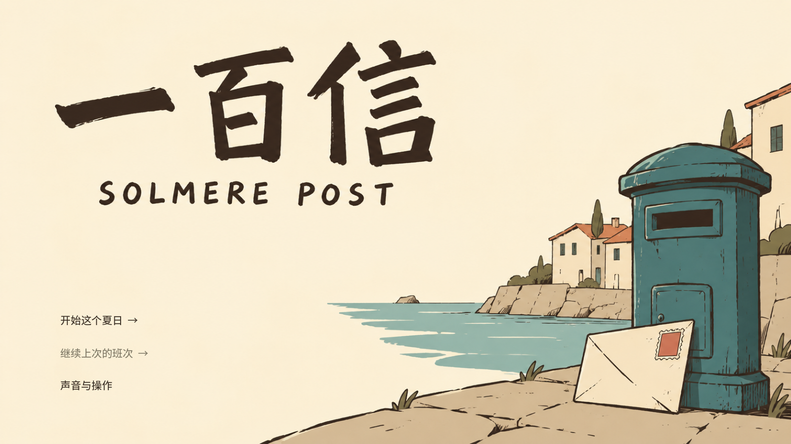
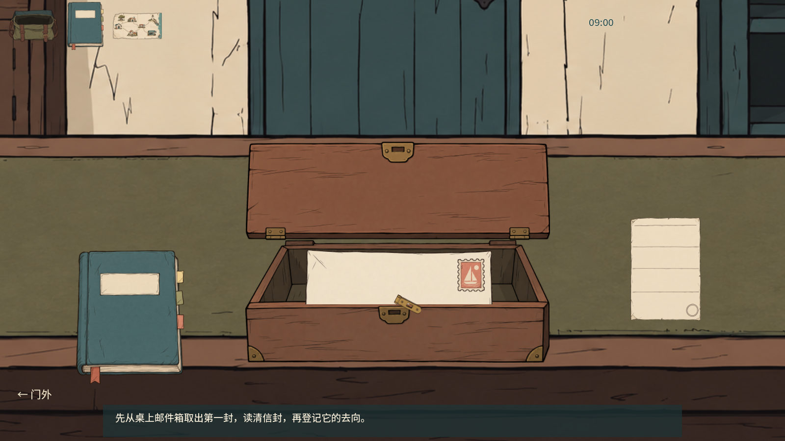
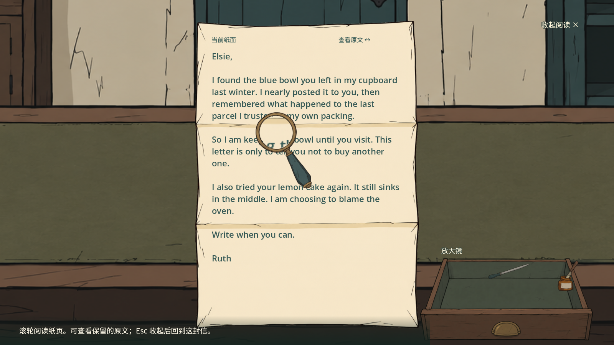
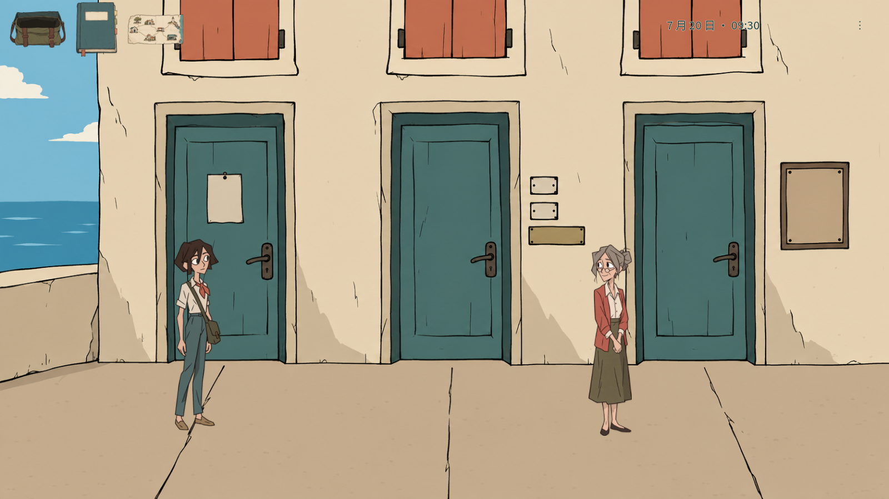
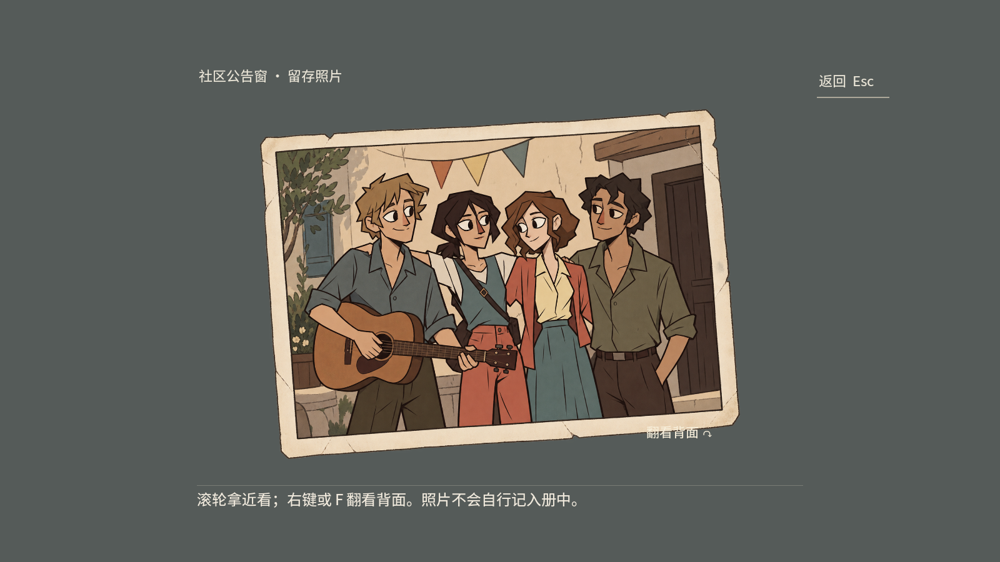
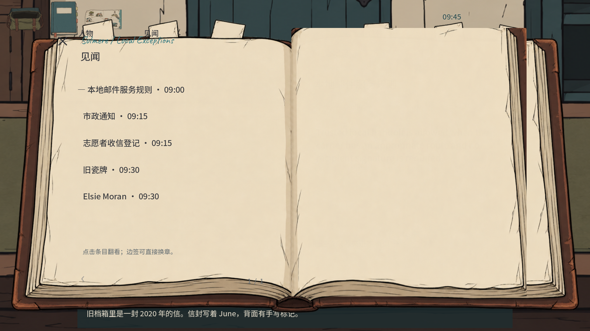

# 一百信 · Solmere Post

海边小镇，异常邮件部的一天。核对旧地址、行程与档案；查清事实之后，由你决定怎样处理五封来信。

当前包含五封案件、七处地点，以及从取信、调查、交接到回局盖单的完整班次流程。入口为 Godot 4.7.2 的 `scenes/final_slice.tscn`。

| 标题与开始 | 柜台取信 |
|---|---|
|  |  |
| 信件放大 | 小镇调查 |
|  |  |
| 留存合影 | 工作档案 |
|  |  |

以上为本游戏实际运行截图，未经拼贴或重绘。图像来源、检查范围与已知限制见 [本次画面记录](docs/testing/ART_ACCEPTANCE_20261002.json)。

## 开始与操作

用 Godot 4.7.2 导入 `project.godot` 后运行；已有 Windows 构建包则双击 `100letter.exe`。源码、构建与 GitHub Release 的状态分别记录，不以截图代替发布验证。

1. 听完主管的短交代，松开箱扣、向上掀盖，把第一封信拖到面前。
2. 查看信封正反面，出门核对门牌、公告与知情人的说法。用 WASD、方向键或点击地面行走，点击物件会先走近再调查。
3. 从信袋拿起要交接的信，再交给现场收件人或合适的收信处。
4. 回邮局填写实际处置，复核后亲手拖章。第一封盖单后，第二、三封才进入邮件箱。

| 操作 | 用法 |
|---|---|
| 信袋、档案、地图 | 左上物件入口；快捷键 B、J、M |
| 调查 | 走近物件再查看；照片滚轮放大、右键或 F 翻背；读到具体内容才记录发现 |
| 信件工作台 | 拖动信件、右键翻面、滚轮缩放；拉开实体抽屉取工具，按纸边进行修复、拆封、抽纸、展开与封回 |
| 有限擦改／附件 | 只在实际展开后出现相关选项；正文原稿保持不变，更改属于玩家持有的副本状态 |
| 邮政处置单 | 分开查看已知事实、填写自己的判断和处置理由；复核后亲手拖动唯一的邮局章盖下 |
| 暂停／全屏 | Esc／F11 |
| 声音 | 标题页或暂停菜单打开“声音与操作”，调整当前总音量 |

实际交付与处置单分开：盖章记录已经发生的处理，不会替你交出信件。每封登记后才能结束本班；错误操作会给出反馈，校验失败不会清空草稿。

阅读与观察不推进游戏分钟。路线在出发前展示用时；步行为 15 或 30 分钟，车站至观景台的上行电车按半小时班次计算候车与行程。急件以实际交接时间判断。四封私人信均有不拆封的处理路径；整班次最多进行三次实际开封（内部职员信也计入；同一封封回后再次拆开另计），拆改痕迹与被发现的行为会留下职业后果。第五封是写给岗位继任者的内部文件。

## 五封信

以下只概括任务，不给出完整解法。英文名称与当前内容目录一致。

| 案件 | 核心任务 |
|---|---|
| 01 · The Street That Changed Its Name | 替 Elsie Moran 核对已经改名的街道与门牌，处理旧地址来信 |
| 02 · Before the Last Shuttle | 找到 Mira Vale，结合设备记录、路线和 17:30 备注安排交接 |
| 03 · The Forwarding Label | 修复 June Arlen 信封外侧的受潮转寄标签，核实旧转寄记录与目前获准的收信处；灯塔照片属于此封附件 |
| 04 · Six Summers Late | 处理迟到六年的档案邮件，结合人物关系与旧记录判断如何处置 |
| 05 · Desk B | 阅读 Helena Voss 留给下一任异常邮件员的内部文件，核对账簿、岗位记录与程序分类，决定档案去向 |

人物册区分已经遇见、已经知道的事实和玩家暂填的推断，未知信息不会自动补成作者答案。档案复核与“应该替别人决定多少”是两件事；选择不等同于统一的善恶评分。

## 美术、原稿与存档

当前入口使用 `assets/faefever_v2/manifest.json` 登记的生成背景、人物与物件：62 个资源键对应 48 张 PNG，包含复用区域和角色帧。箱盖、信封、抽屉工具与邮局章分别参与实际操作。逐项文件校验、实际看过的画面与橡皮边缘检查记录在 [美术检查记录](docs/testing/ART_ACCEPTANCE_20261002.json)；该记录不等同于完整动画或参考一致性验收。

此前已发布的用户原画保留在仓库历史中，协作者的旧入口源码也完整保留。私人 PSD 及其导出留在独立本地归档，不新增到公开仓库，不送入 AI，也不是当前正式入口或 Windows 包依赖。此次选定资源导出排除旧版画面、原画及参考截图；新素材来源见 [当前美术清单](assets/faefever_v2/manifest.json)。

新版进度位于 Godot `user://final_v2/progress.json`，声音设置另存于同目录的 `audio_settings.cfg`。它与旧版 GameSession 存档分离。正式记录使用可校验内容、临时文件和备份；严重损坏时可恢复操作检查点。未盖章处理单草稿另存于进度文件旁的 `.drafts-v1.json`，保存草稿不会代替实际盖章。测试使用隔离数据目录，不接触玩家进度。

## 验证与本地构建

需要本地 Godot 4.7.2、Python 3，以及同版本 Windows x86-64 release template。构建要求官方模板来源记录和 SHA-256 校验相符；脚本不自动下载工具。

~~~powershell
# 新版核心/物理模型及独立组件；默认不运行私人归档检查，也不进行视觉验收
./tools/check.ps1 -GodotPath "C:/Tools/Godot.exe" -PythonPath "python"

# 额外运行实际 Godot 输入与 GPU 截图检查
./tools/check.ps1 -GodotPath "C:/Tools/Godot.exe" -PythonPath "python" -GpuChecks

# 默认先运行检查，再导出；-GpuChecks 可同时要求 GPU 检查
./tools/build.ps1 -GodotPath "C:/Tools/Godot.exe" -TemplatePath "C:/Tools/windows_release_x86_64.exe" -TemplateManifestPath "C:/Tools/Godot-template-source.json"

# 可选：仅当已保留完整私人归档时运行；该路径不上传仓库
./tools/check.ps1 -GodotPath "C:/Tools/Godot.exe" -PythonPath "python" -ArchiveChecks -ArchiveRoot "C:/LocalArchives/Solmere"

# 构建后检查真实 PCK 内容，并让正式 release 可执行文件启动
./tools/verify_package.ps1 -GodotPath "C:/Tools/Godot.exe" -PackageDirectory "../100letter-Windows-Faefever-20261002"
~~~

GPU 检查覆盖物证、档案、工作台、处置单及宿主流程。它们是程序驱动的真实引擎输入，不是 100 名真人试玩，也不证明参考手感、音效听感或满意度。历史模拟画像、旧版 100 路线与当前验证应按各报告的源码和时间分别阅读，不能累计成新版“全部通过”。

导出采用选定资源及依赖：新版场景、登记的新生成图片、授权声音、`data/rebuild/` 的案件／对话／有限更改数据、角色脚点数据和字体许可。构建会检查同配置 ZIP 清单，拒绝工作目录、第三方参考截图、旧主场景、原画与被排除候选进入运行包。`verify_package.ps1` 再读取实际 PCK 的贴图／数据并启动正式可执行文件；这些检查不能代替构建产物的完整原生试玩。Godot 的规则见 [官方导出说明](https://docs.godotengine.org/en/stable/tutorials/export/exporting_projects.html)。

`test-results/`、`work/`、运行缓存、录像和研究截图不随源码更新发布。少量经过选择的本游戏截图可放入 `docs/screenshots/`。默认检查不依赖私人 PSD，并明确输出 `ArchiveChecks NOT RUN`；选择 `-ArchiveChecks` 时只读校验独立归档，负例仅修改临时副本。它不是完整游戏验收。历史检查见 [验证记录](docs/testing/AUTOMATED_VALIDATION.json)，新版边界见 [状态接口](docs/FINAL_STATE_INTERFACE.md)。本轮 Faefever 官方宣传片的实际取样范围和尚未观看的完整玩法边界见 [画面研究](docs/testing/faefever_reference/REVIEW_20261002.md)。

## 范围与授权

当前包含五案及七处地点的调查、物理信件操作、交接、正式盖单与存档恢复。可选棋摊对弈／塔楼小游戏不是本次已完成内容。真人首轮体验时长、完整参考一致性、全硬件兼容性和商业发行终审仍未完成；标题、部分 UI 与场景组合也不能因自动测试通过就视为美术验收完成。

用户原画与原创内容不会因为进入仓库而自动改为开源授权。Godot 为 MIT，所列字体为 SIL OFL 1.1，第三方拟音按各来源记录使用 CC0。参见 [原画来源](docs/ASSET_PROVENANCE.md)、[声音来源](docs/AUDIO_PROVENANCE.md)、[第三方说明](docs/THIRD_PARTY.md)。参考游戏用于研究，不将其手机截图、美术或音轨作为本游戏运行素材分发。
