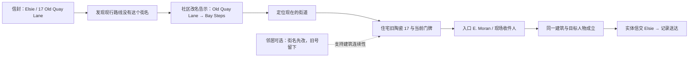
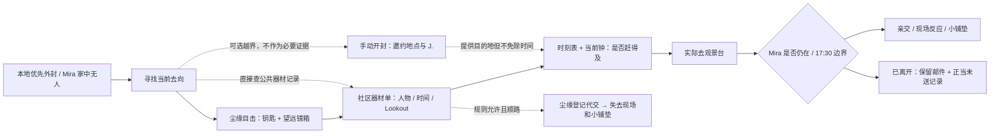
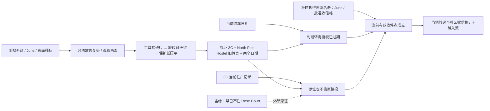
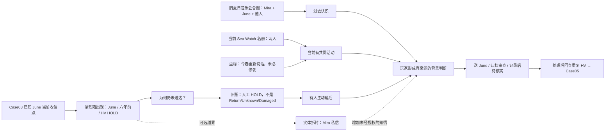
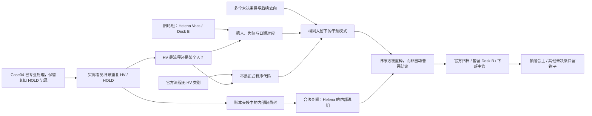

# 最终五案可玩性与逻辑桌面审查

日期：2026-10-01。依据最终制作包的 Case Bible、NPC Knowledge Matrix、World/Postal Rules、Time/Trust、Flow、Interaction 与 QA 文档，参照 旧版实际审计（本地历史资料，未随公开源码发布）。**这是设计与数据依赖审查，没有执行新版、没有真人参与，不是五案通过报告。** 未改 runtime 或案件数据；源包原文不变。

图中箭头表示“提供信息／触发上下文”，不表示每个节点都要被系统收集才允许下一步。实线只在叙事确有顺序时使用；虚线是补充或替代信息。不得把图直接翻译为固定数量的盖章条件。玩家获得的信息、私人所知、实际处置与职业评价分别记录。

## 总体判断

最终五案比旧版更有因果：改名→本地亲交→迁居转寄→旧关系→前任职员。主要剩余风险是具体时间尚未统一、资料呈现替玩家下结论，以及合理“暂存”被做成无代价万能跳关。

| 优先级 | 必须先解决的问题 | 为什么影响玩法 |
|---|---|---|
| P1 | Case02 15:05 记录、17:30 离场、末班车与全日开工时间统一 | 未来资料不能早晨已盖完成章；迟到不能把信交给仍站在场内的 Mira；不能靠办案数跳时制造压力。 |
| P1 | Case03 两个可见日期与当前日期真实可读，外修不直接开放私信 | 只写“已过期”会把核心判断交给系统；合法修复自动读信又会抹掉隐私边界。 |
| P1 | Case04 事实明确但伦理不评分；归档不等于退寄件人 | 收件人本已写明，旧身份谜题会造假困难；无退件地址不能自动退 Mira。 |
| P1 | Case05 returned 的方向、HV 发现顺序、外封署名一致 | 已退走的信不应同时在箱里；读过 Helena 署名后再硬藏姓名是虚假推理。 |
| P2 | 物件与 NPC 真正携带事实，外部路线不是线索清单 | 自动答案句、统一观察章、强制四卡会使中高难度变成照指令办事。 |
| P2 | 两案以上有真正不同调查路线，且离场可恢复 | 多个热点都给同一句终点不算多路线；不同路线不能被隐藏的全收集门槛重新并回一条。 |
| P2 | 每案处置所需的最低专业记录清楚 | 正当暂存应成立，但无依据点一次 Hold 不应抹掉所有调查与后续档案条件。 |

“中高难”宜来自资料有效期、关系背景与知情边界的交叉，不来自找一像素、读长段说明、旋转容差很窄或反复往返。Case01 保持容易，Case02 轻推理，Case03 资料矛盾，Case04/05 逐步重释；不用让全部案件同样沉重。

## Case01：街道改名

**原包事实：**Ruth 寄给 Elsie，17 Old Quay Lane；海堤重建后 Old Quay Lane 改为 Bay Steps。住宅保留旧陶瓷 17，当前门牌不同，入口公示 E. Moran。正文只是碗与柠檬蛋糕，不能拿它做隐藏地址答案。

可走社区告示→住宅，也可先住宅看到旧号／人名疑问→回查改名资料。后者改变发现顺序，不应因没有先点任务指定热点而无效。邻居是方向帮助，不能替代可见的旧号与地名材料。若玩家已准确定位并在场遇见收件人，不应仅因为漏点第三张“记录卡”拒绝投递。

**卡点与修正建议：**

- 包未给新的具体门牌号。美术／数据必须为“旧 17／新号不同”补一个一致值并记为实现补充，不能本场景写 17、档案又写仍为 17。无需新增密码。
- E. Moran 只是缩写，不能在没有来源时自动展开到全部家庭资料。信封给 Elsie 的姓名，现场确认可自然完成对人，不增加新强制测验。
- 公告标题、旧陶瓷数字应在场景构图可辨；需要放大看正文，但不靠发光箭头或写着“旧地名线索”的按钮找它。
- 法律上可越界拆但没有必要；不能为教程无端封死工具，也不能以看正文作为普通奖励。收件人是否分享只可由明确自愿行为提供。

**恢复与待执行断言：**读告示中退出再来，记录不丢；带信离开住宅再来，信仍在邮袋；取消交接不算完成；旧街名经确凿材料对应后允许正确交付；不读正文可完成。合理待核实需保留案件和原因，不进入职业失败。

## Case02：末班接驳前

**原包事实：**Mira 的本地优先亲交，外封不显示寄件人，17:30 前尽量。家中无人。尘缘看见钥匙和望远镜箱，只导向社区；器材单写 Mira、折叠望远镜、returned 15:05、Lookout。正文署 J.，私拆后才给邀约私情。

**不同路线：**目击→公共记录→亲送；直接公共记录→亲送；条件成立后的委托。私拆是额外知识路线，不能把它做成效率最高且无代价的标准解法。委托丢失的是额外铺垫，不得切断 Case04 的全部外部证据。

**P1 现实与时间问题：**

- 15:05 的“归还”若属于当天，在那之前不能作为已发生事实显示。建议时表驱动记录的借出／预期／已归还状态，或明确历史日期。不能自行把 returned 翻成预定归还而不记解释。
- 器材归还证明一个事件，不严格证明“她现在仍在观景台”。将它呈现为合理下一步，最终到场验证；不要由 UI 直接宣布人物实时位置。
- 明确 17:30 瞬间与离场先后。建议准时条件 `<17:30`，到达 17:30 已离开；记录为实施口径并覆盖 17:29/17:30/17:31。晚到是合法未送，不凭一次晚到显示 Probation Concern。
- 亲交与代交需明确服务允许登记接力且无需签收；尘缘当前行程、承诺到达时间必须与地图一致。不能无论他在哪都一键托付，不能委托后信还可打开。
- 最终包未给末班精确时刻，旧 route17 的三个班次不自动成为新权威。需先做全日成本表，核对正常路线有余裕、可选绕路会产生取舍；不要宣称理论路线能准时等于真人感到适度紧迫。

**恢复与待执行断言：**问完尘缘离场后可直接查记录；错过接驳还有符合地图的步行／正当未送路径；取消委托不丢信，完成委托只有一个持有者；委托失去的铺垫不影响 Case04 公共解法；到达时刻与 Mira 是否在场共用状态；慢读与放大不耗时。

## Case03：过期转寄标签

**原包事实：**June，水损地址与部分贴于背面的转寄标签。修复揭示 Rose Court 3C、June→North Pier Hostel、去年失效的转寄单。当前 3C 为他人；社区现行志愿表是 Observatory volunteer，批准收信格在 Community Center。照片信与灯塔附件不是公开地址证据。

这是“每份材料都是真的，但不是同时有效”的题。不要让字条直接写“正确答案是社区中心”。志愿身份与收信格要分栏：在 Observatory 帮忙不等于所有邮件应投观景台。

**路线与难度：**可先修复再去查现址，也可先观察住宅／社区记录，再带着信息回去恢复日期。尘缘可以帮助辨认旧情况，但不能凭他一句话得知完整新邮政去向。两条探索顺序共用必要材料事实；不假称有两套完整独立解法。

**P1 卡点：**

- 包只给“两个日期字段”和“去年过期”，没有具体日月年。制作前统一当前故事日期、转寄有效期起止、现行名册日期；必须能从像素读出期限，不把系统自动贴的“过期”作为全部谜题。
- 关键日期被纤维／折叠合理遮挡；若拼前全部地址和期限已完整可见，再强制旋转只是操作税。重建要真正恢复缺失关系或字段。
- 公开外修不授权看内页；修复完成不能自动弹 Leonie 正文或灯塔照。物件仍保持原隐私状态；开私信也不能自动给最新地址。
- 不强制收件人本人在场：这是批准的社区收信格。若 UI 仍要求走到观景台找 Nora，会完整破坏新解法。
- 可重放残片、放下工具、退出保留进度；容差服务于理解，不以像素级旋转难度替代地址推理。此案无 16:00 期限。

**恢复与待执行断言：**残片半途离开、返回继续；先取得现行记录也不跳过物件状态；对准保护纸前不标修复完成；North Pier 过期但真实，不当伪造证件扣信任；错误送到旧 3C 允许回收／更正，不单次 Game Over；外修完成不授予私信阅读权。

## Case04：六个夏天之后

**原包事实：**已知收件人 June，旧 3C，六年前，未写退件地址；HV/HOLD 在旧分拣记号下，来自清理的未决箱。Case03 已让 June 的收信点可查。外部旧活动照、当今 Sea Watch 名单、尘缘知悉今春复谈、邮局人工 HOLD 记录构成关系与机构背景。

**不同路线：**完全不开封，以公开资料理解背景后处置；或主动越界读信，再结合公共资料处置。开放的顺序包括先看旧照片、先见名册或先读账本，但不能一张合照就宣布“恋人／复合”。公共共同活动只支持联系，尘缘的证言说明重新说话，两者均不能证明内心已经和好。

**最重要的玩法边界：**

- June 的姓名就在外封，不是待猜字段。Mira 是正文署名；不开封时不得由系统自动填成确证寄件人。外部合照与关系是背景，不等于证明这封信由 Mira 写。
- 三种处置是不同职业判断，没有绿色道德答案。给出可记录的事实、缺口、历史人工 HOLD，不把“暂存”无条件写成更善良。
- “归档”指交回档案待主管复核，不是退寄件人。原封无退件地址，不应复用旧 return_to_sender→Mira 的接口语义。
- 不要求所有四个外部节点盖章、按固定顺序拖进四槽；应以玩家实际知情和可记录依据承接后果。若某种处置需要补充事实，拒绝理由说清具体缺口而非“还差 1 条”。
- 私拆只增加玩家知情及真实纸张痕迹。相同实体交付不应自动触发完全不同的关系奇迹；是否被察觉依据封口状态／收件人注意，不用随机处罚。
- 旧版“取下合照再送”不是本案规定分支，最终文本也未给该附件；不能把旧照片去向小游戏硬塞回来。外部档案照始终属于公开资料，不需开信取得。

**恢复与待执行断言：**看照片后离场可回查；先归档／暂存也可按处置记录进入 Case05，不强迫交付；错写档案身份能改但不更改实际持有者；不开封可走三种专业处置；重复点击交接不重复传送物件；被委托漏掉 Case02 铺垫仍能查当前共同活动与旧 HOLD。

## Case05：Desk B

**原包事实：**处理 Case04 后发现 HV/HOLD 重复于旧账，夹袋藏内部职员信。轮班表写 Helena Voss—Desk B；官方流程没有 HV 类别。外封已经写 From Helena Voss。内部信说她工作十一年，明知去向仍留下过三封；最终归档、暂留或交下一班主管，不能销毁。

**探索路线：**先从值班表解释 HV，再核对流程；或先排除正式代码，再从轮班找人。玩家也可能先翻出夹袋看见 Helena 署名；此时不再装作不知道姓名，需建立的是“此人／此桌／这些标记／非官方程序”的联系。内部信可以解释动机，但不让它一句话替代所有记录观察。

**P1 歧义与弱点：**

- 原文“two entries were later returned; one is Case04”没有说明退到哪里。若退寄件人则与现物冲突。建议定义为退回 Desk B 待复核，并给回流字段／日期；这是实施解释，必须单独记录，不能改称原包明言。
- Case04 被交走以后，玩家仍应有合法旧账／处置记录可比，不能再要求拖回那封信当唯一钥匙。Case05 解锁基于处理 Case04 后**实际注意到重复标记**，不只检查已处理数量。
- 公开流程若 HV 不在列表，不应系统自动亮“所以是 Helena”。列表给分类范围，轮班表给人岗日期，手写样本／条目给联系，结论由玩家记录。
- 署名已在外封时，档案要如实记录已见名字；把名字遮到解题后会变成设计者扣信息。也不需强迫先选对三个字段才准许翻一页。
- 暂不阅读而归档是 Flow 提到的可能性。要决定哪些是本章节可选知情，哪些是最低档案理解；不能用一个笼统 read=true 门槛把合法未读处置卡死。
- “十一年任职”和“三次明知去向仍扣留”是新文本，不是十一张填格表和三个神秘不存在编号。最终选择无 Destroy、无善恶评分、无在场 Helena。

**恢复与待执行断言：**未处理 Case04／未看 HV 的时候不凭空来第五封；处理后的三种去向都可查账；先看外封后看轮班不回退姓名知识；归档后的内部信不能同时仍在邮袋；同一记录只有一次正式处理；离开账本近景可恢复翻页／对象位置；封存未读与阅读后处置的知情状态不同但均不凭空失败。

## 跨案现实性与下一轮数据合同

以下是需要落地的数据约束，而非新增故事事实：

| 合同 | 最小内容 | 不能替代的判断 |
|---|---|---|
| 日历与时间 | 当前日期／开工分钟；公共记录日期；Case02 在场区间／班次／边界；动作耗时来源 | 不把真实阅读时间换成游戏分钟；不靠强制跳时兑现宣称时长 |
| 物件 | 唯一 ID、拥有者／位置、封口状态、正反检查、可见字段、正文访问授权、修复进度 | 看过不等于合法可读；展示不等于交付；推断错不撤销既成物理交接 |
| 证据 | 原文与可见图形、来源、知情者、发生／有效时间、公私性质、支持／不能支持的命题 | 合照不证明爱情；旧真实地址不证明当前去向；信任不改变事实 |
| 处置 | 各案合法目的地／原因记录、真实所有权变化、职业状态、人物回应、后续发现机会 | 未送达不自动失职；暂存不自动道德最优；交付不自动消除私拆痕迹 |
| NPC | 当前所在位置／日程、已相遇事件、可谈主题与知道的事实 | 不未见先显名；不把资料照片上的名字伪记为当场相遇；不得凭空知道信内内容 |
| 版本与保存 | 最终包数据版本、稳定迁移或明确独立存档、正在操作的安全恢复点 | 旧 Nora 数据不可静默读成新 June；无须删除用户旧存档来开展新版测试 |

最小可玩闭环仍是完整 Case01 的三处空间，而不是单地点摆好五张信封。之后优先验证 Case02 时表和 Case03 公私界限，再做 Case04/05。记录阶段的审查不能证明阅读时长、触感、推理难度或道德选择已让人信服；这些必须由实际输入路线、可见画面、听音与首次玩家观察分别检验。

## 2026-10-02 正式实现对照与现场叙事接口

以上为原设计桌审历史。最新用户已授权完成全部五案并统一运行美术，原始素材留档，既有五案正文与保存规则保留。本轮实际修复和模型验证如下，不把它写成完整宿主、视觉或真人测试通过。

- 新增 `data/rebuild/final_dialogues.json`：5 名现场 NPC、20 段情境话题。只补现场中文对话，未改 `final_cases.json` 的五封原始正文、身份、期限或证据事实。
- `dialogue_greeting(npc_id)` 只在现场相遇后返回招呼；`dialogue_topics(npc_id)` 只给 `{id,label,question}`，不含隐藏答复或作者答案。话题依据实际看过的信封、资料或真实收件状态出现。
- 玩家问句完成后宿主调用 `speak(npc_id,topic_id)`，返回 `{error,answer,evidence}`；只有此刻提交该人物能作证的资料。职员指向借用簿、公告或登记表，不替玩家隔空阅读。离场后不能继续远程问答，重复回答不扣时间或刷信任。
- 修复委托临界时刻：约定到达时间已等于当前时刻，不能才把信交出。邮件继续在邮袋，玩家可当面重新确认未来时刻，避免形成无法明确等候的过期回执。
- 修复收工地点：五案与处理单齐全也须回邮局才允许 `end_shift()`，异地调用不产生结尾或状态变化。
- 保存仍使用既有 version 2 / postal-resolution-v4；新对话事实写入既有 evidence / encounters，不新增伪造历史或破坏原槽的迁移。

| 案件 | 真实取得与调查连接 | 实际完成方式与不泄露的边界 |
|---|---|---|
| 01 | 柜台首封→读旧地址→社区改名公示／住宅旧号与住户牌→Elsie 在场确认 | 信交 Elsie 后回局登记盖章；也可有原因地退回／待核实，不强制私拆。首份处理单才释放 02/03。 |
| 02 | 新托盘件→住宅敲门→尘缘目击→社区望远镜借还簿→时刻表与观景台现场 | 17:30 前亲交；合规委托必须约定未来到达且等待真实回执。晚到仍保管原信，回局记录未送，不能远程交付。 |
| 03 | 新托盘件→真实抬残标／旋转对位／保护纸压平／展开外折→读两个日期→现住户和现行志愿登记 | 转至批准社区收信格，或回邮局进入当地邮路。观察与 NPC 指路不提前授外修完成，授权外修不开放正文或照片。 |
| 04 | 实际已知 June 现行收信点→邮局旧档箱→旧封背 HV/HOLD→旧音乐合照／现 Sea Watch 表／尘缘证言／旧账 | 在场交 June、回局档案复核或待核实；公共资料不证明私人寄件人或关系已和好。处理后可用已有账簿记录继续，无需取回交走的信。 |
| 05 | 04 实际处置→实看重复 HV→账本夹袋职员封→旧轮班表／正式流程／退回 Desk B 记录 | 有来源的推断草稿与三种合法去向分开。可不拆内部封而归档；所有处理单完成且委托回执已到后回局收工。 |

已核对 23 个证据 ID 的职责：17 项公共实物观察、4 项现场人物证词、2 项依赖真实纸态的标签/信背观察。宿主应在实际观察动作后调用 `observe`，而非打开界面即授予。有限改字/附件的回应使用已有 `pending_recipient_readings(person_id)` → 玩家选择等待 → `witness_recipient_reading(id)` → `recipient_feedback(id)`；收信格或委托不远程播收件人内心。

实际验证：`tests/final_case_state_smoke.gd` 在 Godot 4.7.2 headless 完成 **3348 项、0 失败**；本轮比此前 3135 增加 213 项，含情境问答/公开信息边界、精确委托临界、异地收工，以及 `_full_narrative_route()`。这条完整五案路线只沿公共 API 与真实物件模型操作推进，没有直接赋值时钟、证据、处置或结尾；五案均有实际去向和盖章单，全程不读私信，末尾保存并 Continue 恢复。其他既有分支覆盖九种 04×05 处置组合、授权外修、限定改字/附件、三次被察觉失败与恢复、未来保存格式保护及损坏备份恢复。

真实结果与当前代码/数据/模型 SHA256 保存在 final_case_state_results.json（本地历史资料，未随公开源码发布）。这不验证当前新美术宿主输入、实际手感、音频听感、推理难度或真人满意度；对应综合测试仍由宿主回归补齐。
