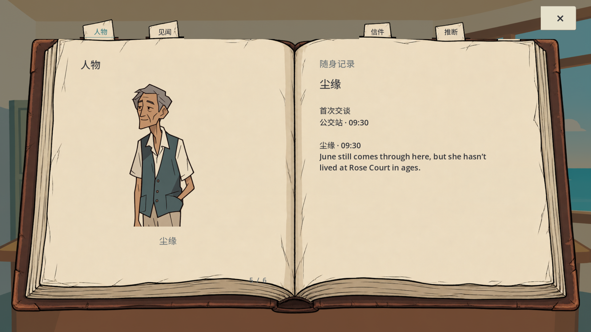
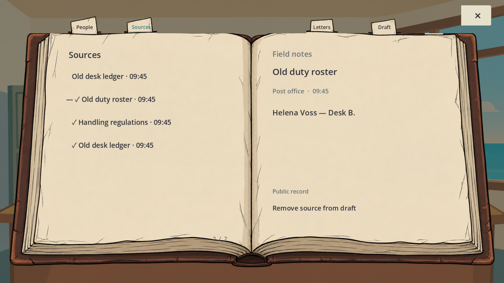
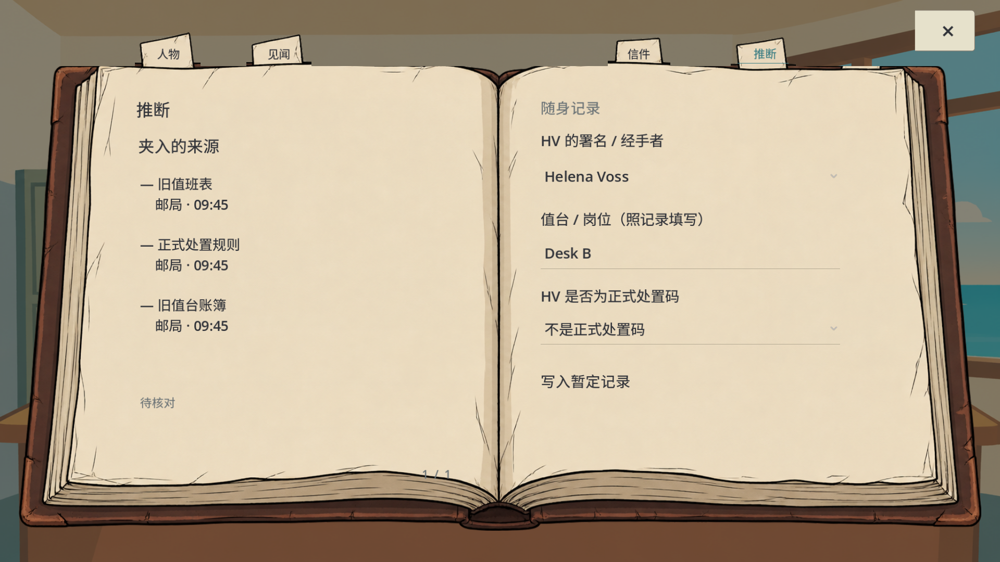

# 档案阶段检查 · 2026-10-03

本轮对应反馈：档案不好看、有错位、文字跑出图像；更像实体记录簿，但保持非写实手绘。保留原书页、场景与人物资产，没有新生成或融合原画。

## 本轮变化

- 左右纸叶分别限制文字，保留书脊和纸边留白。正文可换行、长记录可滚动，标签不挤进图案。
- 人物独占一个跨页：左页使用已有手绘人物的半身肖像，右页记录首次交谈地点、时间及实际观察。没有遇见的人不自动补肖像或隐藏身份。
- 章签从绘制用的同一组纸签区域定位，统一宽高与基线；英文缩小字号。只显示有内容的章节。
- 页角翻页、页码、翻页动画/声音调用及右上角 × 保留；去掉解释怎样使用档案的额外提示。
- 记录、来源、暂定推断仍分开，不把玩家草稿改成自动答案。

## 状态链

打开档案 → 点击已有纸签 → 查看人物/来源 → 点击实际页角翻页 → 从来源页加入或移除引用 → 填写并记录暂定推断 → 点击 × 收起 → 重开保留已写入的记录。Esc 是另一条关闭路径。

上述状态链已用 Godot GUI 输入事件测试；它不是原生 Windows 鼠标输入或真人新手试玩的证明。来源引文保持原文，英文页仅验证档案组件的标题和控件；整个游戏的语言切换仍未完成。具体结果与失败记录见根目录 QA_REPORT.md。

## 本轮完整截图

以下都是 1920×1080 的实际 Godot GPU 视口图，没有拼贴、重绘或把设计稿当运行截图。截图来自隔离的档案测试，测试预置合法的公开观察记录；不代表玩家已在完整游戏中走完所有观察。

## 验收边界

本轮截图人工检查了纸边留白、肖像比例、文字位置和标签轮廓。原生输入、失焦恢复、声音试听及玩家美学验收仍待完成；自动通过不能替代这些检查。其他信袋、地图、NPC 和新三封信的阻断项继续保留在需求复核表中，没有借这一轮档案修复宣称整个游戏完成。
