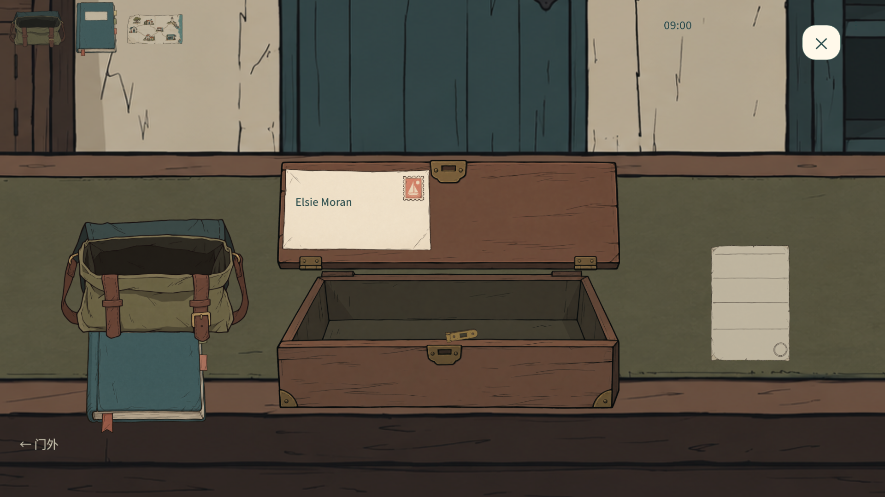
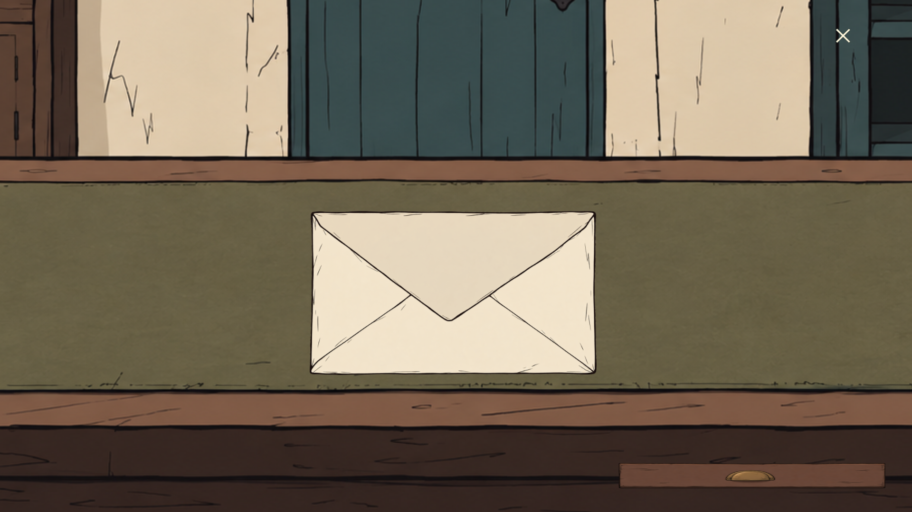
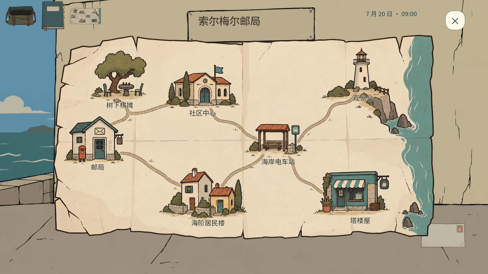
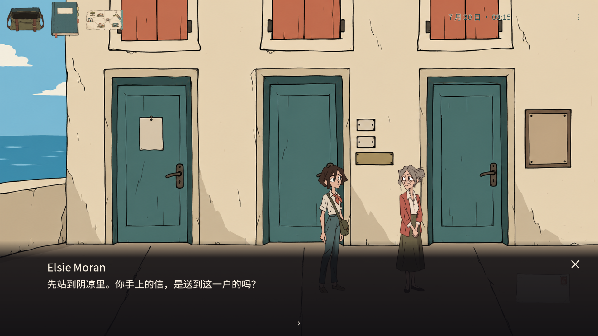

# 核心交互复核 · 2026-10-03

这是一轮整改记录，不是最终游戏验收。完整历史要求及未交付项在 [逐项需求复核](../REQUIREMENTS_REVIEW_20261003.md)，当前测试结果在 [QA_REPORT.md](../../QA_REPORT.md)。认可的场景、人物与纸张原图保持不变；本轮未调用生图。

## 实际状态链

- 封面：纯奶油底色 → “一百信 / SOLMERE POST” → 开始或继续。不存在插画背景；没有存档时继续不可用。
- 信件：主管说明桌上手提箱 → 松锁扣 → 拖箱盖 → 拖出信 → 原工作台上抬起 → 同一信封翻面、拖动、滚轮缩放 → 叉号放回并保存。再次从信袋点信封直接检查，不再有“查看详情 / 拿在手上”独立按钮。
- 地图：打开纸图 → 点已知地点 → 地图收起 → 近程迈步、轻转场 → 到达。一次选择只计一次行程；当前地点不计时；转场期间点击信袋或档案不能插入第二个页面。
- 对话：点人物 → 先走近 → NPC开口 → 玩家话题 → NPC回应 → 叉号返回现场。对话和话题都有明确叉号，不需要知道 Esc。
- 档案：实体书页与章签 → 已遇见的人物肖像、原话和来源 → 页角翻页 → 暂填推断 → 叉号保存返回。记录不会自动补全未知身份。

## 本轮改动

常规旁白、操作教程条和快捷键 tooltip 已移除。世界中的信件、档案文字与 NPC 对话仍保留，保存失败属于系统错误，会明确显示。主管介绍第一件的调查目的、线索所在实物和回局登记，未加入任务箭头或整屏教程。

信封邮政文字按真实纸面安全区域换行和适配字号。书的左右叶分别裁切。对白根据文本长度安排高度，叉号有可辨识的底色。角色九个姿态在场景建立时预载，失焦取消正在行走的旧回调。

## 失败和边界

旧失败日志保留。曾出现：2560尺寸下自动输入没有命中章签，随后测试访问空控件；测试封面错误读取默认存档；对白叉号释放点击未关闭；五案路线一次没有打开住户页，后续测试连锁失败。测试已补正确鼠标掩码、隔离存档重新绘制、明确叉号按下响应、等待失败的现场诊断与停止空控件访问。住户页问题目前复跑未复现，不能宣称已经证明其根因。

还发现转场期间能开信袋/档案、深色背景里的叉号不明显；已增加忙碌守卫与叉号浅底。画面检查等待实际抬起动画结束，不能把中间帧当成最终显示。

当前阶段没有交付新的千字三封信、分散语义修改或真实火漆制作。全游戏英语切换、真人新手连续30分钟、完整声音试听与所有参考视频逐帧研究也未完成。旧五案路线通过不能替代这些要求。

本轮实际1920×1080截图随最终检查更新至同目录 `core_20261003/`。这些是引擎视口图片；原生输入与新手试玩证据另外记录，不相互替代。

最终自动结果：16套引擎检查7297条、独立窗口关闭及重新启动29条，均无失败；具体范围在 `CORE_QA_20261003.json`。构建包PCK检查165条与正式EXE GPU启动通过。实机工具找到独立QA窗口，但激活失败，刷新捕获显示Windows锁屏；没有执行原生鼠标操作或试听，不能标记实机验收通过。
