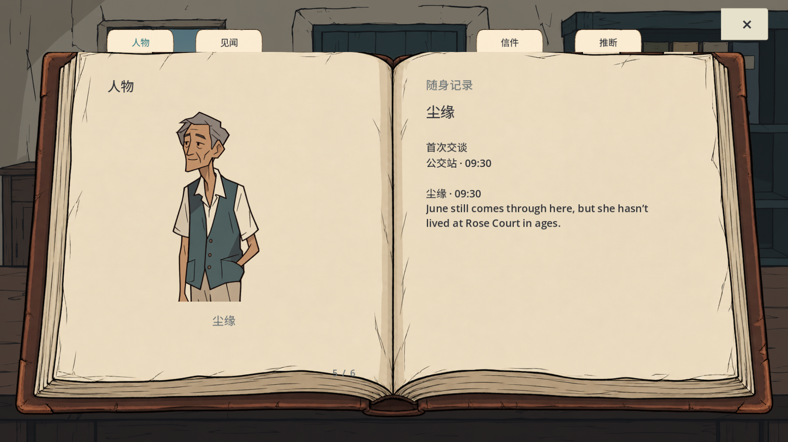
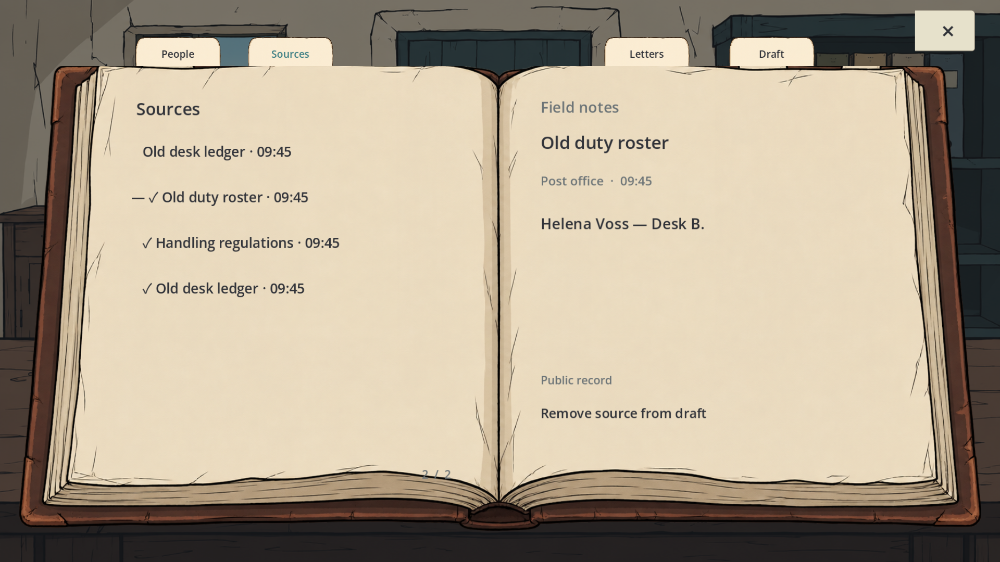
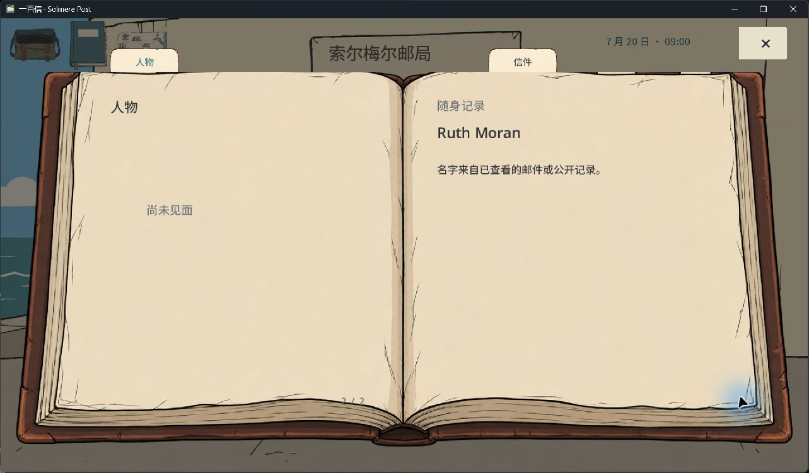
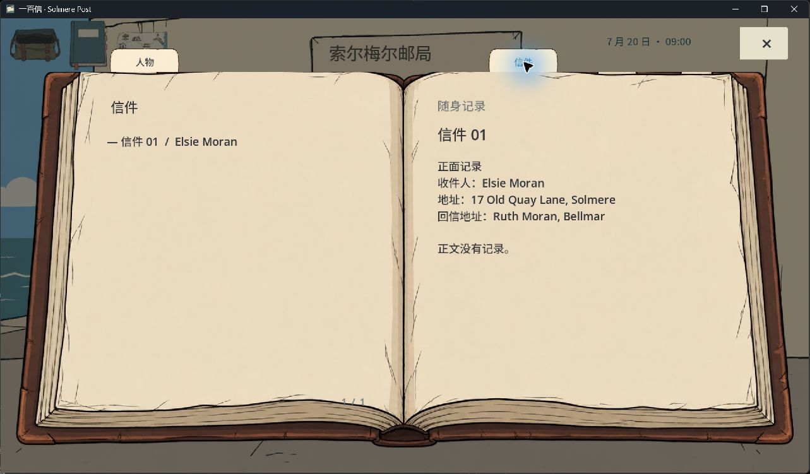

# 档案页角实际点击复核 · 2026-10-04

本阶段修复一个实际鼠标测试发现的问题：书页右下角看起来可翻，但点击绘制的纸角没有反应。旧测试点击的是控件中心，漏掉了物件图形与点击区不一致的问题。

保留原书页、场景、肖像、字体和章签。翻页区域移到实际纸角，悬停不再出现矩形背景；上一页同样修正。测试改为向独立指定的绘制纸角发送真实 viewport 输入，避免再次用控件中心证明控件本身。

| 检查 | 结果和边界 |
|---|---|
| 完整回归 | `check-20261004-044026`：17 套件，7,494 项检查，0 失败。旧版 7,496 数字为历史记录；两个控件存在性检查被物件位置输入替换。 |
| 档案 | 新运行 1,626 项检查、25 张 GPU 画面；中英组件在 1280×720、1920×1080、2560×1440 内排版；不代表全游戏英文化。 |
| 窗口关闭/恢复 | `window-close-20261004-044631`：29 项检查通过。 |
| 工作流程 | 28 项 Python 检查通过。 |
| 正式 Windows 包 | 实际 PCK 解码 167 项检查、正式 EXE GPU 启动 120 帧通过。PCK SHA256 `cddb5f6c6f3f3cef310ad1379c431e1dc25ad17e5d9ece26b1e826123ce603ff`。 |
| 实际鼠标 | 独立 QA 存档重启后继续，右纸角从 Elsie 1/2 翻至 Ruth 2/2，左纸角翻回；×、Esc 都关闭到场景；重进保留信件地址和回信地址观察。 |

实际鼠标测试使用 SHA 相同的正式 EXE/PCK 副本，独立存档 `user://qa/native-followup-20261004/progress.json`。前一轮已完成取信、拖动、滚轮放大和右键翻面；前一轮图片与修复后图片分别保存。原存档与用户原试玩进程未改动。系统截图是 1285×751 逻辑像素；下面的完整 1920×1080 图片来自 GPU 测试，不混称原生全尺寸截图。

这是开发复核包。实际音效试听、新手盲测、完整原生中英/三尺寸复核仍无证据；不把自动检查当成人类验收。CORE-BOOK 仍在 review。旧的章签/引导 Release 对应 2691492，是此次修复前的历史检查点。新三封长信、分散语义修改和实际火漆步骤尚未完成。角色记录为同一个 Codex 的逐项职责检查，没有启动独立评审智能体。
