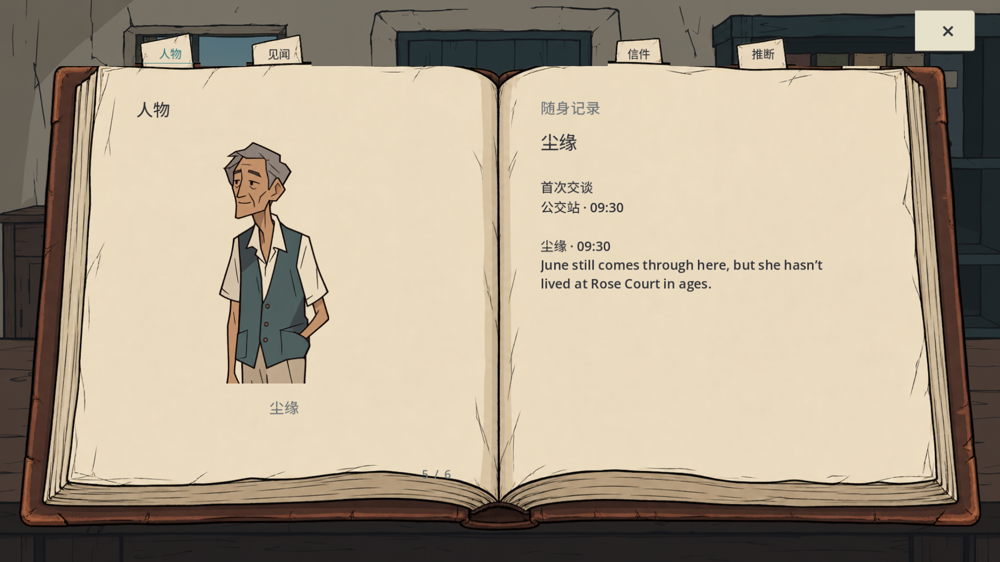
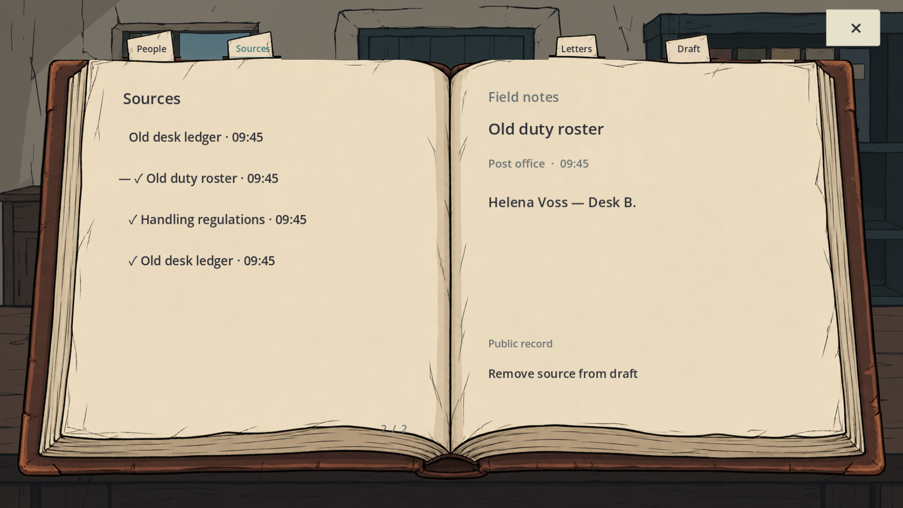

# 工作室流程实际使用 · 2026-10-03

根据用户最新反馈，把固定 CCGS 从来源/测试校验扩展到实际制作结构：project.yaml、design/、production/epics/、当前任务板、具名职责、依赖、反向审查、影响分析和交接命令。本轮没有更换游戏入口、运行时脚本、美术或原存档；不是一次新画风或游戏重写。

## 实际执行

制作板有八条有序故事：档案、信袋、地图、NPC、行走反馈、三封新信。当前只有 CORE-BOOK 活跃，既有实现保持“待验收”，不因为有测试就登记完成。生成了六份具名任务并按职责顺序检查；不是六个独立代理，也没有启动49个代理。

| 职责 | 本轮做过的事 | 结论范围 |
|---|---|---|
| UI程序员 | 查纸内位置、肖像、翻页与关闭代码；改QA背景依赖 | 未重写运行时，不能代替实机验收 |
| UX | 对照实物动作合同和退出/重进检查 | 首次玩家理解与原生输入未测 |
| 美术指导 | 查看下方两张当前1920视口图，核对纸边、文字、肖像和叉号 | 仅这两帧；全游戏风格与玩家认可未评定 |
| Godot职责 | 查锚点、裁剪、页Tween/信号、Esc和重复关闭边界 | 有限代码审查通过；没有声称全项目技术无缺陷 |
| QA-lead | 找到旧私有背景依赖，修正后跑当前1484条检查；保留提前退出记录 | REWORK，证据缺口和未解释的提前退出仍存在 |
| 音效职责 | 查翻页/关闭cue、素材池、冷却、增益和变化 | 没有试听，NOT_ASSESSED |

原始具名记录位于 `production/qa/reviews/core-book-20261003/`。每项绑定当前输入哈希和原始日志/图像，明确哪些观察没有执行。不填造假的PASS或代理身份。

## 发现、修改、复测

档案测试原来加载 `assets/generated/post_office_interior.png`，这是未随公开源码发布的旧本地图。已改为正式选中的 `assets/faefever_v2/backgrounds/BG_workroom.png`，并加一条实际加载路径断言。协作者测试不再依赖这张私有图；当前截图也与正式选图一致。没有修改图像文件。

- 管线/证据拒绝测试：28项通过（13项证据门槛 + 15项制作管线）。测试临时夹具不构成游戏、真人或声音证据。首次新测试因Windows默认GBK读取UTF-8任务文件失败，显式UTF-8后通过。提交前还修正了跨平台源码指纹：仅CRLF/LF转换等价；真实内容或适配器逻辑变化使审查过期，证据原始字节变化仍被拒绝。
- 正式选图后的当前档案GPU/输入测试：`test-results/studio/book/20261003T135546061667Z`，Godot4.7.2，**1484项、0失败、25张视口图**，源码运行期间不变。覆盖三尺寸与组件中英标题；不等于全游戏双语。
- `20261003T134329678948Z`曾退出0却未写完整结果；适配器按“No fresh result”拒绝。保留 `studio_20261003/incomplete-engine.log`。随后使用确切GUI编辑器的完整测试通过；提前退出的根因没有被证明，不能称为已修复。
- 真实 `finish/handoff`保留NOT_COMPLETE：没有实际OS输入、试听和首次玩家记录，验收项未全核实。不会推进后续故事或把自动结果当玩家同意。
- `impact --path scripts/rebuild/final_playable.gd`实际查出信袋、地图、NPC和第一封新信受影响，列出相应专业职责，供下一轮回测使用。

1484仅是本轮聚焦测试。旧7326完整回归是源码提交5402b72的历史证据，本轮没有重复宣称一遍全流程或建立新的Windows版本。运行时代码/资产未变，已有Windows复核包保持原源提交对应关系。

## 当前真实截图

下面是GPU引擎视口，已查看；不是Windows鼠标试玩截图。

流程接入通过不等于游戏最终验收。来源开启未复现问题、原生操作、音效、新手试玩、完整双语、千字三信、分散语义修改与真实火漆仍未完成。微信和被拒绝的参考视频没有被绕过或假称已发送/看过。
