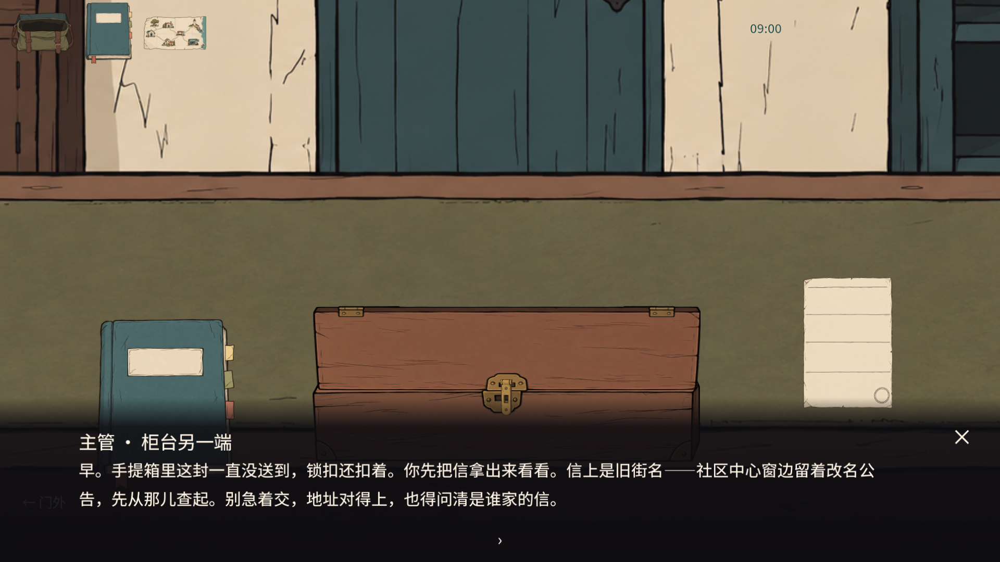
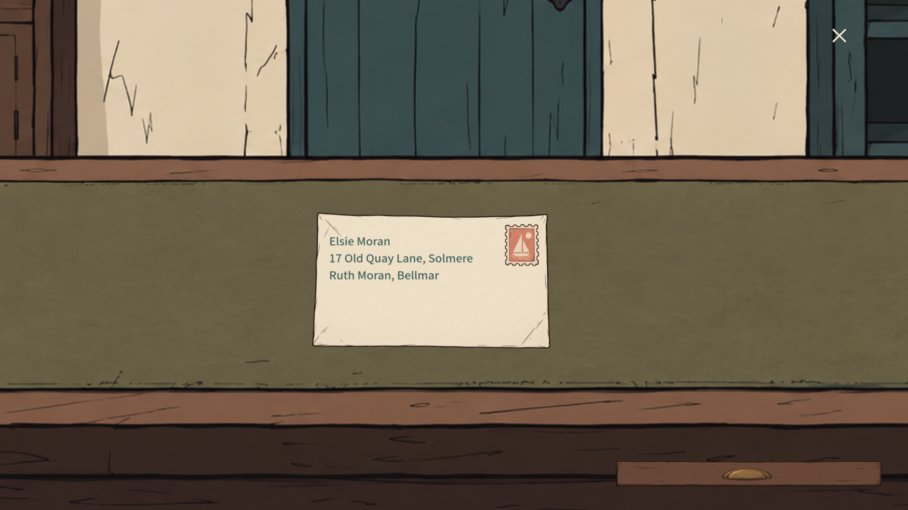
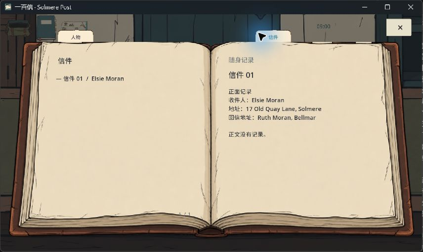

# 章签与首个动作复核 · 2026-10-04

保留原书页、人物和场景。只替换过斜的章签，统一四块纸签的轮廓、文字基线和点击范围；没有内容的章签仍不出现。来源和完整生图提示词见 [资产记录](../art/INDEX_TAB_20261004.md)。

首个流程：主管交代未送达信件和社区中心改名公告 → 点锁扣 → 点击或拖起箱盖 → 点击或拖出完整信封 → 信封抬起移到原桌面的检查区 → 翻面、移动、缩放 → 点 × 回柜台 → 信进入真实持有状态，箱里不留复制件 → 出门调查。箱盖的单击转动有 0.32 秒过渡；动画期间的连击不会重复开合。未解锁时箱盖会抵住。

主管对白从长段落缩短为当前行动和调查目的。文字区按实际字形换行高度调整，修复短对白仍出现滚动条的问题。没有任务箭头、旁白说明或现代信息卡。

## 1920×1080 引擎实图

## 复核结果

实际引擎 17 个套件、7,496 条断言全部通过；窗口关闭/重载另 29 条通过；生产工作流另 28 项通过。包括两条五封信完整路线、改信后真实交接、存档恢复、页面关闭和三种分辨率。档案的中英控件布局被检查；全游戏并未完整翻译为英文。

新手操作回归 54 条：显式叉号结束对白、误点锁住箱盖有反馈、松锁扣后单击/拖动都能开盖、连击不能打坏动画、单击取信、检查叉号关闭、持有状态和观察状态落盘、原桌面不产生重复信件、出门回到可探索场景。引擎事件不能等同于真人首次试玩。

失败证据保留：最初新测试使用错误缩放输入；改用已有 viewport 适配器后暴露了真正的对白高度问题，已修复并复测。对应日志都在同目录。已查看本页四张实图，章签与书页衔接、文字范围和对白均可读。

仍待验收：真实用户是否理解全程目标、实际音效试听、30 分钟新三封信和真实火漆流程。CORE-BOOK 保持 review；此次开发提交不宣称达到完整商业游戏验收。

## 当前 Windows 包的部分实机检查

通过真实 Windows 鼠标输入，检查了纯底游戏名封面、新游戏、主管对白叉号、档案打开、信件章签的边缘点击、档案叉号关闭，以及信袋直接点击信封进入原桌面的检查区。窗口内文字与章签可见，实际画面如下。窗口为 855×512；上面的 1920×1080 图来自引擎测试。

开箱和取信期间检测到用户输入，因此不把随后已打开的箱子状态算作独立实机测试。翻面时再次检测到用户输入并停止自动鼠标操作。翻面、缩放、快速输入、恢复和三尺寸中英检查的现有结果属于自动引擎测试；完整实机、音效试听和陌生玩家理解仍未完成。未删除或回滚玩家现在的进度。

本轮复查了 [Faefever 官方 Steam 页面](https://store.steampowered.com/app/1276550/Faefever/) 的叙事与调查定位，以及 [Broken Age 官方页面](https://www.doublefine.com/games/broken-age) 的手绘冒险定位。采用短对白、具体调查目的和物件直接响应是本项目的实现判断，不代表已逐帧确认这两款游戏的全部交互。此前工具拒绝的视频链接未绕过、未声称看完。
