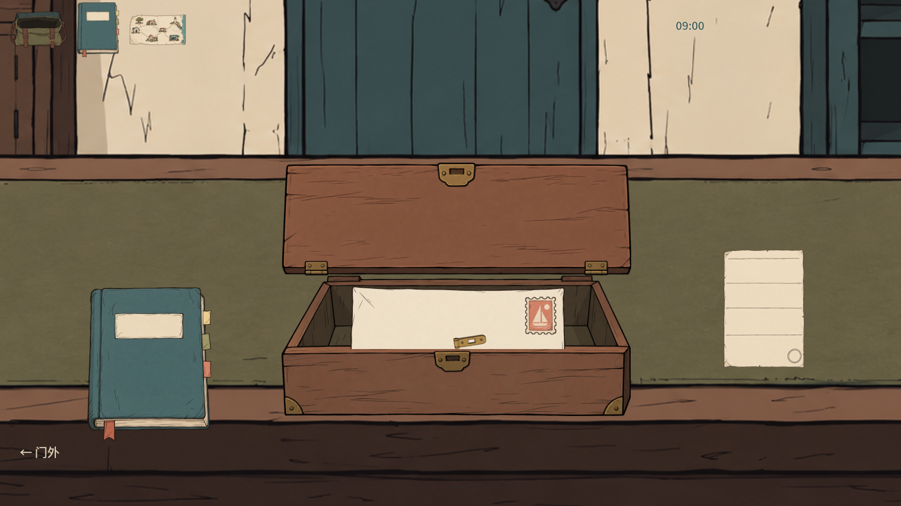
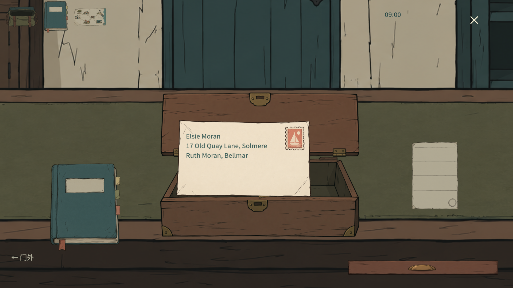
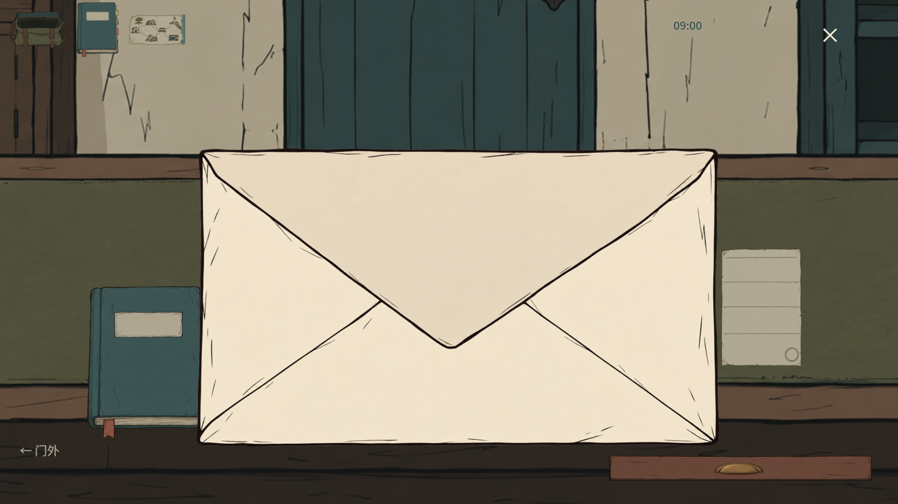
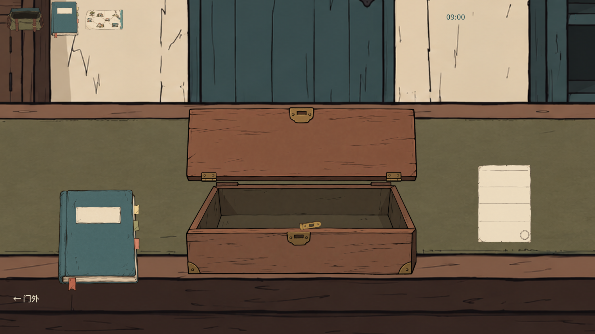

# 实物操作连续性整改 · 2026-10-04

本轮处理反馈“体验感不真实不流畅”，范围是既有的 **手提箱取信 → 检查 → 放回**。保留认可的场景、纸张、美术、剧情和存档结构；没有推进后续地图、NPC 或新的三封长信。完整游戏验收仍未完成。

## 这条动作链的变化

| 操作 | 原来的问题 | 当前处理 |
|---|---|---|
| 点击箱盖 | 内部状态打开，鼠标不再移动时画面仍关闭 | 箱盖每个动画帧主动刷新；无需补一次鼠标移动 |
| 拖出信封 | 检查页重新铺背景，原箱子消失 | 保留实际柜台和打开的箱子，背景轻微降权；同一封信移到焦点 |
| 拿起、移动、放下 | 缺少接触层次，错误放置突然归位 | 小幅抬起和阴影；拖动直接跟随指针；错误放置短暂滑回原信堆 |
| 滚轮和翻面 | 状态立即跳变；缩放与拖动容易脱节 | 短翻面、连续缩放；以指针所指纸面细节为中心；接手拖动停止当前缩放 |
| 关闭检查 | 正常的多次小幅拖动会导致无法关闭/保存 | 附着标签使用固定相对位置；坐标采用小于可见像素的统一精度，完整材料校验保留 |
| 旧存档微移 | 近似位置比较跳过实际移动，随后误判附着物 | 每次真实位置变化都重放，再严格比较全部物件状态；不放宽材料修改权限 |
| 从信袋重进 | 中央信件和右下角图标同时出现 | 焦点模式隐藏场景中的同件图标，放回后恢复可点击物件 |
| 空闲柜台 | 每帧重绘整个场景 | 静止时不重绘；运动和悬停才更新；信封文字布局复用 |

## 逐状态复核说明

1. 开始新班次；主管以对白交代异常件与社区公告的位置，关闭对白的叉号后恢复柜台。
2. 点击真实锁扣，扣片移开。点箱盖即可打开，也可拖动掀起；点击后不再移动鼠标仍能看到开箱结果。
3. 拖动暴露的信封到面前。原柜台、打开的箱子、书和处置单仍在背景中；箱内不残留同一封信。
4. 拖动信封、滚轮放大、右键翻面；原地址随同信封移动和缩放。连续滚轮之后可直接接手拖动，无需等待整段动画。
5. 点可见叉号，信封沿短过渡收回信袋，柜台恢复控制。再从信袋点同一封信，保留已观察面、位置和缩放；场景图标在检查期间隐藏。
6. Esc 也可安全放回。误放、快速重复点击、焦点丢失和重新读取存档分别有测试，避免关闭后留下输入捕获。

四张完整 **1920×1080** GPU 图在本目录下方。匹配试玩包的原生鼠标复核见 `tactile-mail_20261004/native.json`，目前为部分完成，不能替代完整动作链验收。这里是逐状态说明，不把静态图片说成录屏。

## 测试与保留的问题

最终 `check-20261004-140043` 全部 **18 套件 / 7,585 项**通过，专项 **77 项**，窗口关闭/恢复 **29 项**，制作流程 **28 项**。源文件指纹和日志见 `tactile-mail_20261004/evidence.json`，逐事件专项结果见 `result.json`。专项保留了连续 40 次分数坐标重抓、缩放中接手拖动、重复翻面、快速双击关闭、错误放置、旧存档微移、重进和焦点丢失。普通路径助手只等待有限的既有过渡；原始快速输入专项不使用这些等待，防止把竞态藏起来。

静止柜台连续 90 帧没有重绘。墙钟帧耗时是本机离屏进程的记录，不能当作所有电脑的 FPS 承诺。文字布局复用检查独立于这个帧耗时。

匹配正式包实际解码 **167 项**通过，正式 EXE 的 **120 帧** GPU 启动通过，运行资产保持原选择。源码提交 `1fc42e6199e03e91d41cf3b4b91fad131e2d76f3`，PCK SHA256 `40a0b66dcf169330be34f624f64400c2dc9f4759ce8696837d684684a24a3144`。已上传 [Windows 复核包](https://github.com/HuieChen/100letter/releases/tag/solmere-tactile-mail-2026-10-04)，GitHub 字节数与 SHA256 匹配。源码提交两次 CI 均成功；随后的报告提交不改变运行代码或包。

实际匹配包进入标题，鼠标点“开始”显示主管对白；点击可见叉号时，工具返回 `unknown screenshotId screenshot-0`，重新选窗口和截图后的单次重试仍失败，停止原生输入。当前匹配包的原生整链 **未通过验收**。此前源程序原生操作图片用于定位箱盖不刷新和重复图标，并非最终包操作通过的证据。保留失败和本次主管窗口，避免把旧图当新成果。无音效试听结论。

保留失败记录：初次专项把运动中的抓点当作矩形中心，断言错误；PNG 同步保存产生下一帧长间隔，过早采样错过短缩放，采样前等待数个普通帧后修正。后续确实复现附着坐标漂移造成关闭/保存拒绝，三次重抓修复仍不足，最终使用固定相对位置及统一精度并扩为 40 次。真实窗口又发现箱盖不刷新与重进重复信封，两者修复后增加直接检查。一个离屏全流程失去 OS 焦点而中止步行，测试窗口设为不争抢桌面焦点；正式游戏保留真实焦点丢失反馈。以前的 `CORE-SOURCE-OPEN` 观察仍不因此宣称已找到根因。无 GPU 的截图尝试发生空纹理错误，不算有效通过。

## 工作室职责复核

顺序执行，无并发代理或伪造独立审查：

| 职责 | 实际工作与结论 |
|---|---|
| UX | 实际鼠标操作定位箱盖无可见更新、重进重复物件；修复后复核同一条动作链。未做新手盲测 |
| gameplay-programmer | 跟踪附着标签漂移和信任边界重放；正常拖动可提交，伪造单独标签移动仍拒绝 |
| Godot | Tween 单一控制、取消时使用当前可见状态；关闭只触发一次、停止输入捕获；按精确坐标重放旧存档微移 |
| performance | 静止帧不整面重绘、复用文字布局；仅记录本机测试采样，不声称性能质量已经普遍达标 |
| art-director | 对照认可的原物件与当前完整画面；美术资源字节未改动，不进行又一次风格替换 |
| QA | 分开正常、错误、退出、重复进入、旧存档、快速输入、窗口关闭和真实鼠标检查；保留失败而非只保留最终 PASS |
| sound-designer | 检查既有纸张、工具和门声音触发代码；本轮未试听，结论 **NOT_ASSESSED** |

Tween 接手方式参照 [Godot 官方 Tween 文档](https://docs.godotengine.org/en/stable/classes/class_tween.html)：同一属性使用一个控制源，取消旧运动后从当前值继续。这是工程依据，不替代游戏可用性测试。

尚未完成：音效真实试听、第一次玩家的理解测试、完整原生中英/分辨率矩阵、新三封长信和实际火漆流程。`CORE-BOOK` 仍在 review；没有把本轮整改当作后续故事的验收。当前阶段报告、本地画面和 GitHub main 保留成果，微信汇报未成功发送。
