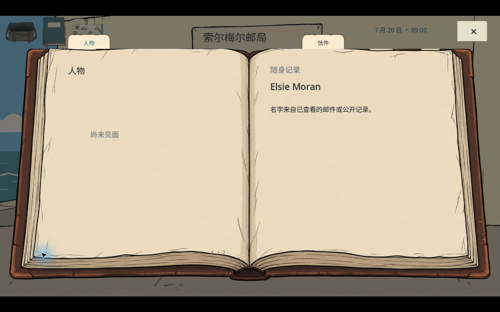

# 发布与补测记录

修复源码已快进推送 main，运行代码提交 `48774fce4751a5660f5007dec0f9f278c562bd32`。此次仅补充文档、截图与证据校验触发范围；后续 main 提交不改变这个试玩包的运行代码。

[Windows 开发复核包](https://github.com/HuieChen/100letter/releases/tag/solmere-paper-corners-2026-10-04) 上传成功；94,502,480 字节，ZIP SHA256 `6932e41b8ba8eb4eee8551d5ef30372ba2377d08b68655c51006f95a884a2960`。GitHub 返回的 digest 与本地逐字节哈希一致，包内 SOURCE_AND_QA.json 指定上述源码提交。原始发布回执见 publication.json。

源码提交两次 CI 均成功：[第一次](https://github.com/HuieChen/100letter/actions/runs/37156113952)、[第二次](https://github.com/HuieChen/100letter/actions/runs/37156655811)。CI 校验证据与流程，不替代完整游戏人工验收。

补测使用同一正式 PCK 和独立 QA 存档：

- F11 全屏后，实际鼠标页角翻页与叉号关闭仍可用。
- 右下页角连续五次点击后停在合法的 2/2 页，没有越页或死锁；下一页在末页无可用动作。
- 档案打开时激活已有参考 PDF 窗口，不输入或编辑，随后切回游戏：人物记录、页码保留；左下纸角仍可翻回 1/2。
- 声音与操作设置里的画面内叉号可返回场景。当前设置没有语言切换控件；已记录完整原生双语验收未完成。

这两张系统截图为 1707×1067 逻辑像素，含屏幕比例产生的黑边。单次连续点击和失焦路径不是穷尽式原生压力测试；音效试听与新手盲测依然没有完成。原有六份职责记录保持当时状态，不伪装成新一轮独立评审。整个游戏仍为 NOT_COMPLETE。

发布故障记录：首次 urllib GET 因网络超时未创建 Release；改为 curl 小型 API 请求后创建并上传成功。大文件单次上传耗时约 1,087 秒。未删除或覆写先前发布资产。
